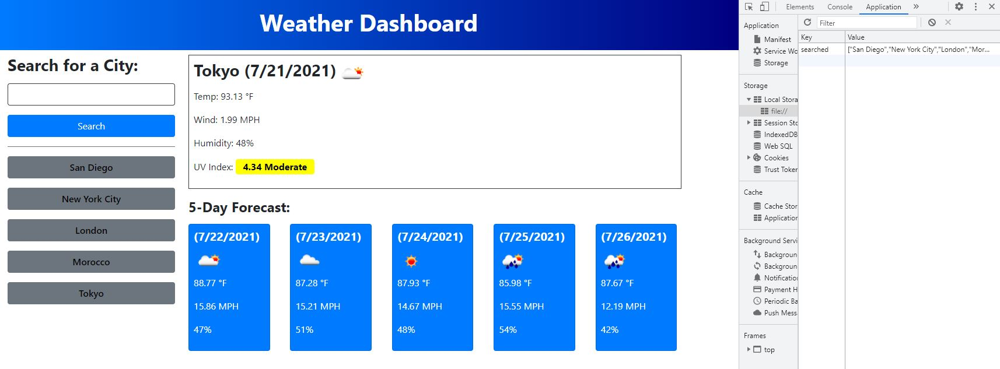

# Weather_Dashboard

## Description

This is a weather search app. Entering a valid location in the search bar and pressing the search button gets and displays the current weather information as well as the next 5 days forecast below that. The current forecast displays the searched city, the date, and the current weather conditions (e.g. cloudy). Below that the temperature, wind speed, humidity, and UV index are shown. The 5 day forecast gives the date, weather condition, temperature, wind, and humidity. Upon pressing the search button in the input form the location is stored locally and a search history button is added below the input form. Pressing on a search history button will display the full weather information for that location.

## Usage

Below is what is displayed upon navigating to the app.

Upon entering a valid location and pressing the search button the following is displayed, as an example. Local storage on the right shows the stored search history.

This is a link of the deployed application: https://xanschwarz.github.io/Weather_Dashboard/
